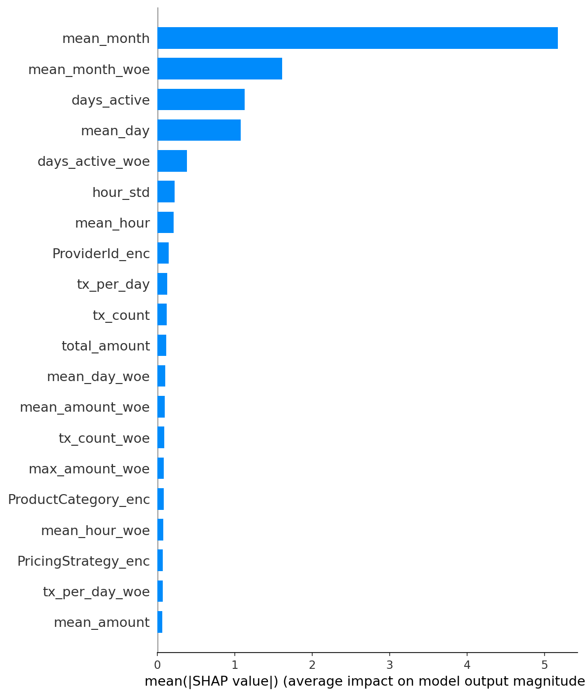
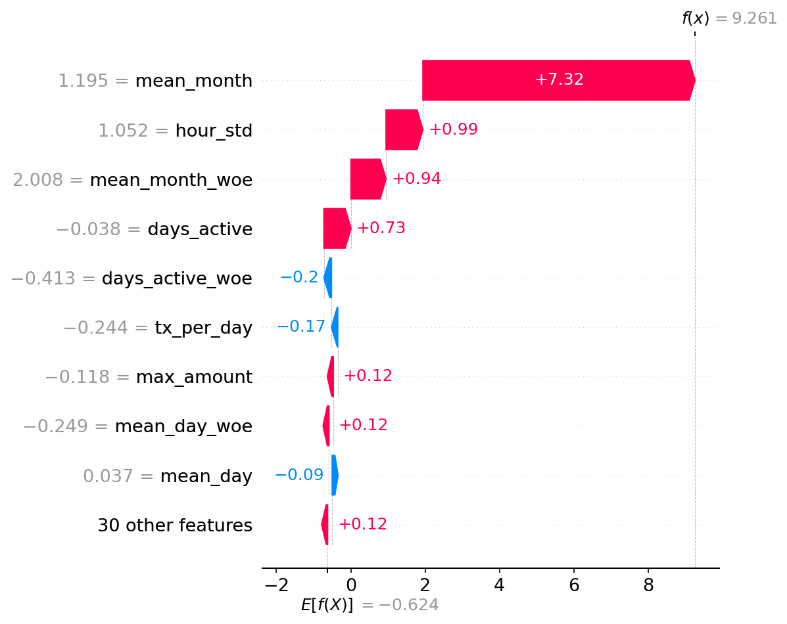
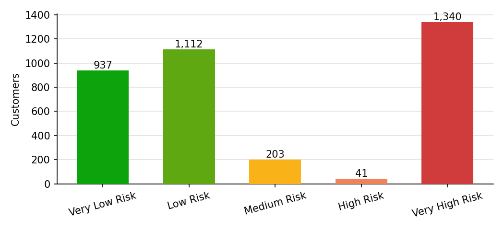
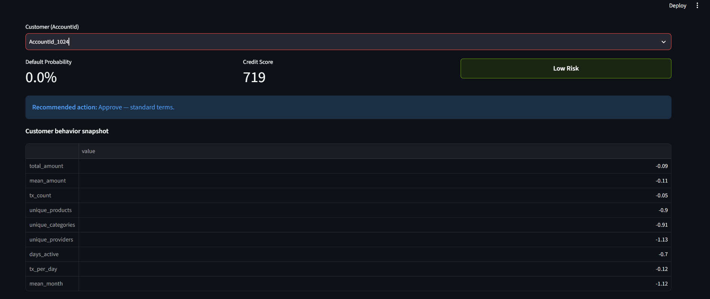
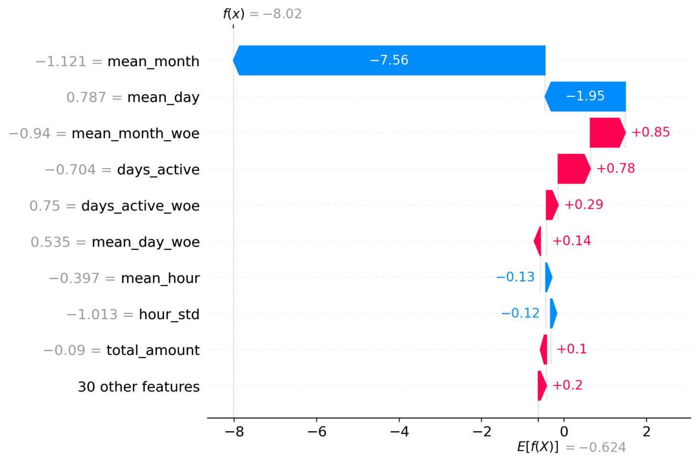

# Credit Risk Probability Model — Bati Bank

[](https://github.com/KalkidanAsfaw/credit-risk-model/actions/workflows/ci.yml)

An end-to-end credit scoring system built for Bati Bank's buy-now-pay-later partnership with an eCommerce platform. The system transforms raw transaction data into real-time default probability scores and credit scores.

## Project Structure

```
credit-risk-model/
├── .github/workflows/ci.yml      # CI/CD pipeline
├── data/                          # gitignored
│   ├── raw/                       # Raw data from Xente
│   └── processed/                 # Processed data & model artifacts
├── notebooks/
│   └── eda.ipynb                  # Exploratory analysis
├── reports/                       # SHAP explainability plots (tracked in git)
├── src/
│   ├── __init__.py
│   ├── data_processing.py         # Feature engineering pipeline
│   ├── train.py                   # Model training & MLflow tracking
│   ├── predict.py                 # Inference & credit scoring
│   ├── explain.py                 # SHAP explainability
│   ├── dashboard.py               # Streamlit dashboard
│   └── api/
│       ├── main.py                # FastAPI application
│       └── pydantic_models.py     # Request/response schemas
├── tests/
│   ├── test_data_processing.py    # Unit tests
│   ├── test_predict.py            # Unit tests
│   ├── test_api.py                # API integration tests
│   ├── test_explain.py            # Explainability tests
│   └── test_dashboard.py          # Dashboard tests (Streamlit AppTest)
├── Dockerfile
├── docker-compose.yml
├── requirements.txt
└── README.md
```

## Quick Start

### 1. Install dependencies

```bash
pip install -r requirements.txt
```

### 2. Train the models

```bash
python -m src.train --data data/raw/data.csv --output data/processed/
```

### 3. Run the API

```bash
uvicorn src.api.main:app --reload
```

Or with Docker:

```bash
docker-compose up --build
```

### 4. Generate SHAP explainability plots

```bash
python -m src.explain
```

### 5. Run the interactive dashboard

```bash
PYTHONPATH=. streamlit run src/dashboard.py
```

### 6. Run tests

```bash
pytest tests/ -v
```

## API Usage

**POST /predict** — Score a customer from their 39-feature vector (produced by the feature engineering pipeline):

```bash
curl -X POST http://localhost:8000/predict \
  -H "Content-Type: application/json" \
  -d '{
    "total_amount": 1.2, "mean_amount": 0.5, "std_amount": 0.3,
    "max_amount": 1.8, "min_amount": -0.2,
    "tx_count": 12, "unique_products": 3, "unique_categories": 2,
    "unique_providers": 2, "unique_channels": 1,
    "fraud_count": 0, "fraud_rate": 0.0,
    "mean_hour": 14.0, "hour_std": 3.0, "mean_day": 15.0,
    "mean_month": 6.0, "days_active": 45, "tx_per_day": 0.27,
    "ProductCategory_enc": 0.0, "ChannelId_enc": 1.0,
    "ProviderId_enc": 2.0, "PricingStrategy_enc": 1.0
  }'
```

**Sample response:**

```json
{
  "default_probability": 0.0821,
  "credit_score": 724,
  "risk_category": "Low Risk"
}
```

---

## Credit Scoring Business Understanding

### How does the Basel II Accord's emphasis on risk measurement influence the need for an interpretable and well-documented model?

The Basel II Capital Accord requires financial institutions to hold capital reserves proportional to the credit risk they carry. To satisfy this requirement, banks must demonstrate to regulators that their risk models are sound, validated, and understood by the people who use them, not just technically accurate. This has three direct implications for model design:

**Interpretability is a regulatory obligation, not a nice-to-have.** Basel II's Internal Ratings-Based (IRB) approach mandates that banks be able to explain how a Probability of Default (PD) estimate was produced for any given borrower. A black-box model that produces a score without a traceable path from input features to output probability fails this requirement. Regulators must be able to audit the model, and credit officers must be able to justify a rejection to the applicant. Techniques like Weight of Evidence (WoE) encoding and Logistic Regression are favored in regulated credit scoring precisely because every coefficient has a direct, documentable effect on the output.

**Documentation is part of the model.** Under Basel II's Pillar 2 (Supervisory Review), banks must maintain model documentation that covers data sources, variable selection rationale, validation methodology, known limitations, and the conditions under which the model should be retrained or retired. A model without this documentation cannot be used in a compliant credit decisioning pipeline regardless of its AUC score.

**Model risk must be measured and monitored.** Basel II requires ongoing back-testing of PD estimates against actual default rates (Population Stability Index, Gini coefficient drift, etc.). This demands reproducible pipelines — fixed random seeds, versioned feature transformations, and tracked experiments — so that model behavior can be compared over time. MLflow is used in this project to satisfy this requirement: every training run logs parameters, metrics, and the fitted artifact.

In short, Basel II shifts the model evaluation criterion from "does it predict well?" to "can we explain, audit, and stand behind it?" — which constrains both the choice of algorithm and the rigor of the surrounding process.

---

### Without a direct "default" label, why is a proxy variable necessary, and what business risks does proxy-based prediction introduce?

The Xente dataset contains transaction-level eCommerce behavior but no historical loan repayment records. There is no column indicating whether a customer missed a payment, defaulted, or was written off. This is common when a financial institution is launching a new credit product with a partner that has not previously offered lending: the behavioral data exists, but the outcome data does not.

A proxy variable bridges this gap by treating observable behavioral signals as a stand-in for creditworthiness. The approach used here is RFM segmentation: customers who transact rarely (low Frequency), have low total spend (low Monetary), and have been inactive for a long time (high Recency) are treated as disengaged, and disengagement is assumed to correlate with inability or unwillingness to service debt. This assumption is grounded in the credit risk literature — behavioral inactivity is consistently associated with higher default rates in thin-file populations.

**However, proxy-based prediction introduces several material business risks:**

| Risk | Description |
|------|-------------|
| **Label noise** | Disengaged eCommerce customers are not the same as loan defaulters. A customer who rarely shops online may be an excellent credit risk who simply prefers offline channels. The proxy conflates platform engagement with creditworthiness. |
| **Circular bias** | If the proxy-trained model is used to deny credit, those customers never get a loan, so their true repayment behavior is never observed. The bank cannot learn whether the model was correct for rejected applicants (survivorship bias). |
| **Disparate impact** | If certain demographic groups are systematically less active on the eCommerce platform (e.g., older customers, rural customers), they will be disproportionately labeled high-risk regardless of their actual creditworthiness. This is a fair lending and regulatory compliance risk. |
| **Proxy drift** | Platform usage patterns change over time (seasonality, marketing campaigns, product changes). A model trained on RFM from 2023 data may produce systematically biased labels if applied to 2026 behavior. |
| **Regulatory exposure** | Regulators expect PD estimates to be grounded in actual default experience. A proxy-based model must be explicitly disclosed as an approximation, with a plan to retrain on true loan performance data as it accumulates. |

The proxy variable is a **modeling assumption, not ground truth.** It should be treated as a starting point — a way to bootstrap the scoring system — with a commitment to replacing it with actual repayment data as the buy-now-pay-later portfolio matures.

---

### What are the key trade-offs between a simple, interpretable model (Logistic Regression with WoE) and a high-performance model (Gradient Boosting) in a regulated financial context?

Both model families have legitimate roles in credit scoring. The right choice depends on the regulatory environment, the maturity of the portfolio, and the institutional appetite for model complexity.

| Dimension | Logistic Regression + WoE | Gradient Boosting (XGBoost/LightGBM) |
|-----------|--------------------------|---------------------------------------|
| **Interpretability** | High — each WoE-encoded feature has a single additive coefficient; the scorecard is a simple points table any credit officer can read | Low to moderate — SHAP values approximate feature importance but cannot produce a simple, auditable rule |
| **Regulatory acceptance** | Well-established; explicitly recommended in Basel II IRB documentation and standard credit scorecard literature | Increasingly accepted but requires additional validation work (SHAP, model cards, stress testing) |
| **Predictive performance** | Competitive on clean, well-engineered features; may underfit complex non-linear patterns | Typically 3–8 AUC points higher on tabular financial data, especially with high cardinality and interaction effects |
| **Handling imbalance** | Requires explicit class weighting or resampling (SMOTE); sensitive to rare event rates | Handles imbalance more naturally via `scale_pos_weight`; robust to class skew |
| **Overfitting risk** | Low — strong regularization via L1/L2; limited model capacity | High — requires careful tuning of depth, learning rate, and subsampling; prone to overfitting on small datasets |
| **Feature engineering burden** | High — requires careful WoE binning, monotonicity checks, and IV-based feature selection | Lower — the model discovers non-linear relationships automatically |
| **Operational risk** | Low — model is a linear equation; easy to implement in any scoring engine, including SQL | Higher — requires a runtime environment (Python/Java) and version-pinned dependencies |
| **Explainability to applicants** | Direct — "your score is 620 because your recent activity is low (−15 pts) and your spend history is strong (+40 pts)" | Indirect — SHAP values must be translated into human-readable reasons, which introduces an additional translation layer |

**Recommendation for Bati Bank:** Given the Basel II regulatory context and the fact that this is a new credit product with a proxy target (not true historical defaults), a **Logistic Regression with WoE** should be the primary production model — it is defensible, auditable, and conservative. A **Gradient Boosting model** should be trained in parallel as a challenger model: if it demonstrates materially better performance on held-out data and SHAP-based explanations satisfy the compliance team, it can be promoted to production after a shadow deployment period. This two-track approach is standard practice in regulated credit modeling.

---

## Model Explainability

Global and per-prediction SHAP explanations for the LightGBM champion model, generated by `python -m src.explain` from the held-out test set (`reports/`).

**Which features matter most globally?**



`mean_month` and its WoE-encoded counterpart dominate the ranking, well ahead of `days_active`, `mean_day`, and the transaction-behavior features. This is a **concerning pattern worth disclosing**, not a strength: it suggests the `is_high_risk` proxy label (built from RFM/K-Means on a fixed snapshot date) may be picking up a *when-did-this-customer-transact* time signal rather than a purely behavioral one. Since the raw data spans a limited window, a customer's transaction month is entangled with their tenure and the snapshot date used to compute Recency. Before this model is used for real lending decisions, this should be investigated further (e.g., re-running the proxy label construction with a rolling snapshot date, or explicitly excluding calendar-time features) to rule out the model learning "when in the dataset's timeline" rather than "how this customer behaves."

**Why did the model make this specific prediction?**



For the highest-predicted-risk customer in the sample, `mean_month` again drives most of the score, with smaller contributions from `hour_std`, `mean_month_woe`, and `days_active`. This is the level of per-customer explanation a credit officer would need to justify a decision to an applicant or a regulator under Basel II's interpretability expectations.

---

## Interactive Dashboard

```bash
PYTHONPATH=. streamlit run src/dashboard.py
```

A Streamlit app for a credit officer to explore the portfolio and score individual customers, without needing to call the API or read code:

- **Portfolio risk distribution** — where every customer in the current dataset falls across the five risk bands.
- **Per-customer scoring** — pick a customer, see their default probability, credit score, risk category, a plain-language lending recommendation (approve / manual review / decline), their raw behavior snapshot, and a SHAP waterfall explaining that specific score.



Roughly a third of the current portfolio (1,340 of ~3,600 customers) falls into **Very High Risk** — this is a direct consequence of how the `is_high_risk` proxy label was constructed via RFM/K-Means clustering, not a confirmed default rate. The dashboard surfaces this caveat directly under the chart, consistent with the proxy-variable risk disclosure above.

**The app itself, running:**





---

## Dataset

Data source: [Xente Challenge — Kaggle](https://www.kaggle.com/datasets/atwine/xente-challenge)

| Field | Description |
|-------|-------------|
| TransactionId | Unique transaction identifier |
| BatchId | Batch processing identifier |
| AccountId | Unique customer account identifier |
| SubscriptionId | Customer subscription identifier |
| CurrencyCode | Transaction currency |
| CountryCode | Geographical country code |
| ProviderId | Source provider of item purchased |
| ProductId | Item purchased |
| ProductCategory | Broader product category |
| ChannelId | Transaction channel (web, Android, iOS, etc.) |
| Amount | Transaction value (positive = debit, negative = credit) |
| Value | Absolute transaction amount |
| TransactionStartTime | Transaction timestamp |
| PricingStrategy | Xente merchant pricing category |
| FraudResult | Fraud flag (1 = fraud, 0 = legitimate) |

